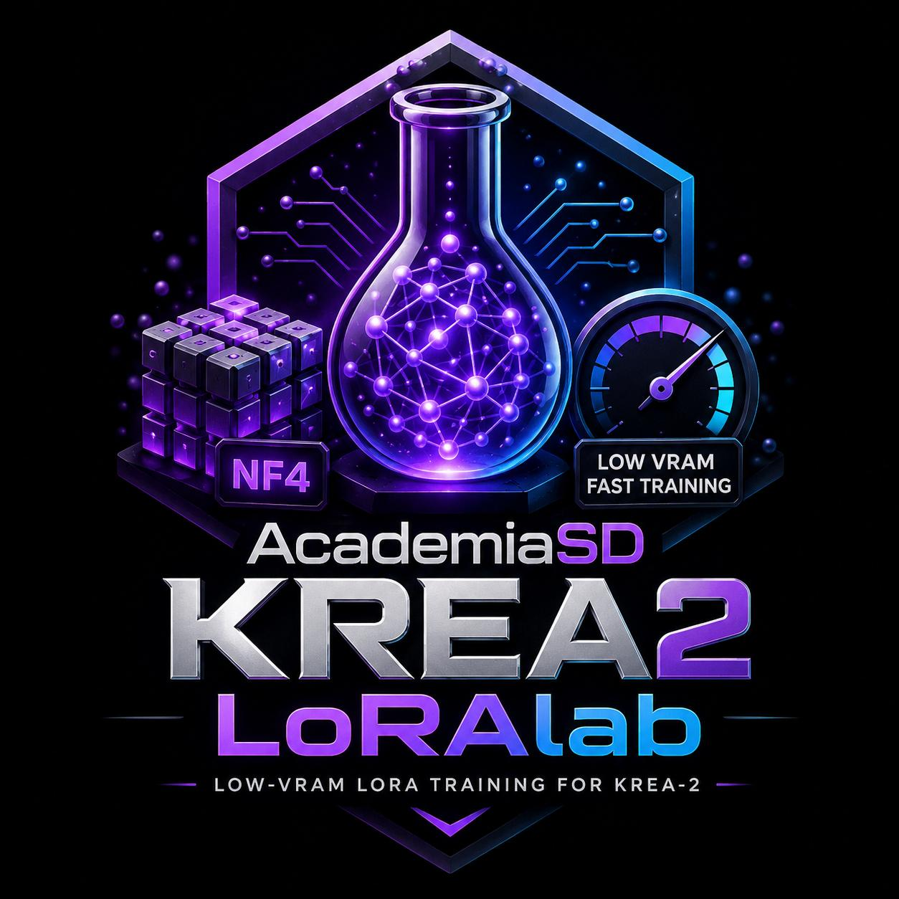
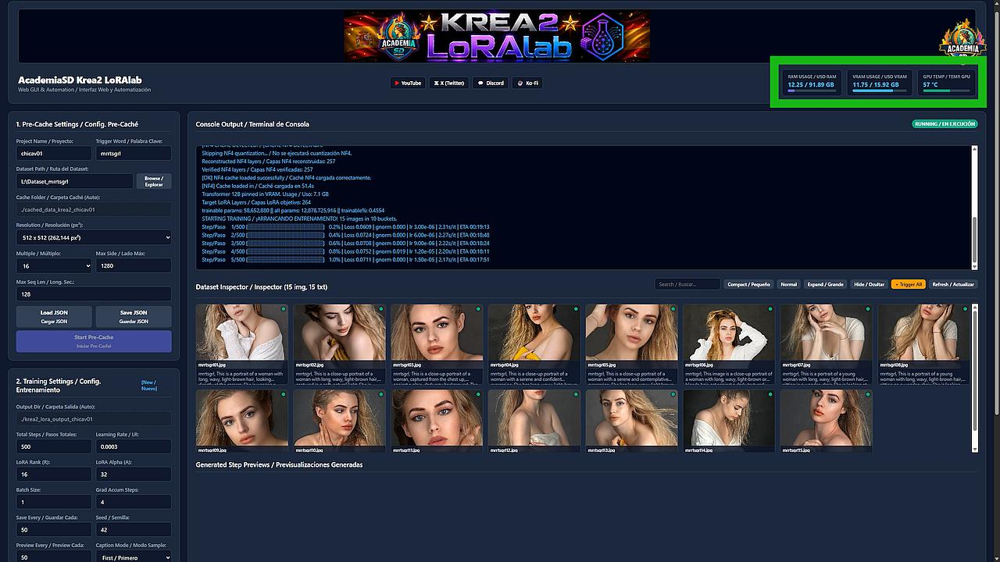

# AcademiaSD LoRAlab-Krea2 Beta v0.71





---

## 📌 Configuración de Archivos de Parámetros (JSON)

> ⚠️ **IMPORTANTE:** Los archivos de configuración reales (`pre_cache_settings.json` y `train_settings.json`) contienen la configuración local y tokens de acceso de Hugging Face (como `HF_TOKEN`), por lo que se encuentran excluidos de las fuentes del repositorio por seguridad.
> 
> Para ejecutar los procesos de forma directa o por lote (CLI), debes copiar las plantillas de ejemplo y personalizarlas:
> 
> ```bash
> cp pre_cache_settings.json.example pre_cache_settings.json
> cp train_settings.json.example train_settings.json
> ```
> 
> Edita `pre_cache_settings.json` y `train_settings.json` para definir las rutas de tu dataset, parámetros y tu token de Hugging Face (`hf_token`).

---

## 🚀 Ejecución en Linux

1. **Instalación del Entorno:**
   ```bash
   ./install_LoRAlab-Krea2.sh
   ```
2. **Ejecución con Interfaz Web:**
   ```bash
   ./run_LoRAlab-Krea2.sh
   ```
3. **Ejecución en Modo Por Lote (CLI / Headless):**
   ```bash
   ./run_batch_cli.sh all
   ```
